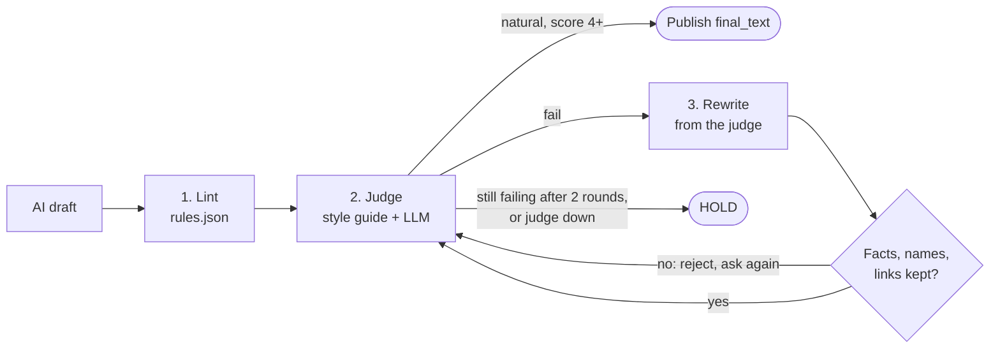

# How id-voice-gate works

[Back to the README](../README.md)

AI-written Indonesian usually goes wrong in one way: the sentence is built in English, then each word is swapped for an Indonesian one. Grammar checkers do not catch it, because every word is correct. A native reader catches it in one line. id-voice-gate puts that native reader in front of your publish step.

## The flow



1. **Lint.** Regex rules in [`idgate/rules.json`](../idgate/rules.json), matched line by line. A `block` rule fails the text no matter what the judge says. A `warn` rule is passed to the judge as a hint. Rules know the difference between a heading and prose, and some only apply to casual text (formal words next to gw/lo). Quotes (`>` lines), code and URLs are skipped.
2. **Judge.** An LLM gets the full style guide, the lint findings and the text, and returns `{natural, score 1-5, issues, rewrite}`. The text passes only when `natural` is true **and** the score is 4 or 5.
3. **Rewrite** (`gate` only). On a failure the judge's rewrite is checked again, up to two rounds. Before a rewrite is used, the gate compares it with the original and rejects it when anything that is not wording changed (see below). A rejected rewrite costs one round and the judge is asked again, with the reason.

**Pass = no lint block, no extra-check block, judge natural, score 4 or higher.**

## Fail-closed

A gate that passes when its judge is down is not a gate. So every one of these is a FAIL with exit code 2:

- the `claude` CLI is missing, not logged in, or times out
- the API key is missing, or the API returns an error
- the judge's answer is not valid JSON, or has no `natural` or `score`
- the style guide file is missing

Your pipeline should treat exit 2 exactly like exit 1: hold the text. If a judge outage blocks everything and you need copy to flow while you fix it, switch to **shadow mode** instead of removing the gate:

```bash
echo shadow > .idgate/mode   # verdicts still logged, the ORIGINAL text passes, no rewrites
idgate mode                  # prints the active mode
rm .idgate/mode              # back to enforce
```

`IDGATE_MODE=shadow` does the same for one process. Every log line records the mode and the real verdict, so what slipped through can be audited later.

## What a rewrite may not change

The judge is told to change wording only. The gate does not trust that, and checks:

| Kept exactly | Example of a rejected rewrite |
| :--- | :--- |
| URLs, hashtags, @mentions, emoji | a link replaced by "link di bio" |
| Numbers, dates, prices | "3 hari" became "5 hari" |
| Placeholders `{{x}}`, `{expr_a}`, `<0>..</0>` | `{{price}}` dropped |
| Paragraph count | two paragraphs merged into one |
| Text inside quotation marks | a testimonial "fixed" by the judge |
| Names and products (ChatGPT, GPT-5, mid-sentence capitals) | Claude became Gemini |
| Number of negations (bukan, tidak, gak, belum, jangan) | "AI bukan pengganti PM" became "AI itu pengganti PM" |

`tidak` to `gak` is fine: same count, same meaning.

## Register and style guides

The register decides which guide the judge reads:

| Register | Picked when | Guide |
| :--- | :--- | :--- |
| `casual` | the text uses gw, gue, lo, lu (or `--register casual`) | [`jakarta-casual.md`](../idgate/guides/jakarta-casual.md) |
| `formal` | everything else (or `--register formal`) | [`formal.md`](../idgate/guides/formal.md) |

`--guide` points at any other guide, by shipped name or file path. The guide's hash is part of the cache key, so editing a guide re-judges everything.

## Cache and log

Everything lives in `.idgate/` in the working directory (`IDGATE_DATA_DIR` to move it). The folder writes its own `.gitignore`, because it is about draft text.

- `cache/`: one verdict per sha256 of text, guide version, kind, register, prompt version, backend and model. An unchanged text never calls the judge twice.
- `decisions.jsonl`: one line per check and one per gate result. It holds a hash of the text, never the text itself.
- `mode`: optional, see shadow mode above.

## Extra checkers

Add your own rule that the regex file cannot express: a banned competitor name, a claim that needs legal review, a price that must match your price list. Their `block` findings fail the text like a lint block.

```python
import idgate

@idgate.register_checker
def no_competitor(text, kind, context):
    if "KompetitorX" in text:
        return [{"rule": "no_competitor", "severity": "block", "why": "jangan sebut kompetitor"}]
    return []
```

From the CLI, `--extra-check "cmd"` runs any command: it gets `{"text", "kind", "register"}` as JSON on stdin and prints a JSON list of findings. A checker that crashes adds a `warn`, it never passes or fails the text by itself.

## Site mode

`idgate site` applies the same gate to a whole project. It extracts every Indonesian string a reader sees, keeps its exact position, judges strings in batches, and writes accepted rewrites back. See [commands](commands.md#site).

## What it does not do

- **Grammar or spelling.** It looks for translated phrasing, not typos.
- **Fact checking.** It keeps your facts unchanged; it does not check that they are true.
- **Other languages.** The rules and guides are for Indonesian. The engine is not, so a guide and rules for another language would work, but none ship.
- **Replace an editor.** It catches the patterns that make readers say "kayak terjemahan". Tone and taste stay yours.
